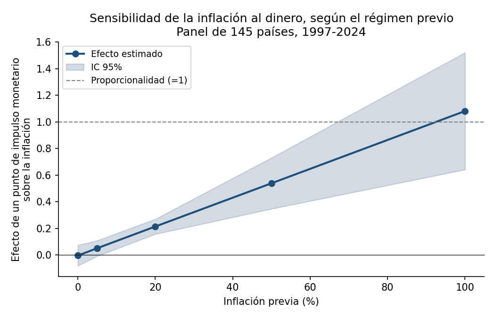
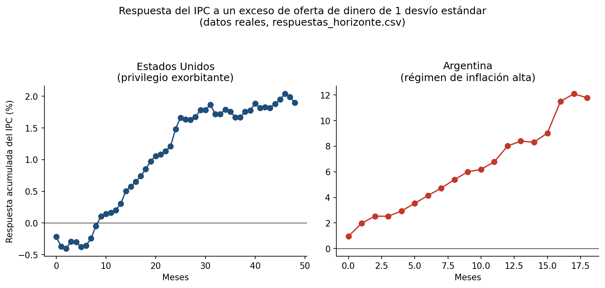
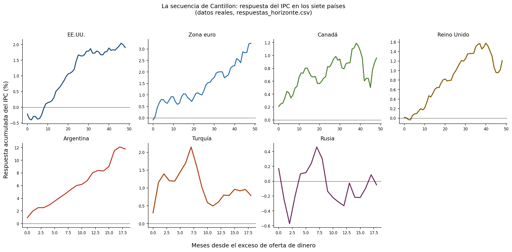

# Dinero, expectativas y regímenes inflacionarios

Trabajo final — Economía Monetaria Aplicada, Maestría en Economía Aplicada (UBA), prof. Horacio A. Aguirre.
Pablo Santiago Martínez Soler.

Panel de 145 países (1997-2024), Argentina mensual, y una extensión a siete países (Estados Unidos, zona euro, Canadá, Reino Unido, Argentina, Turquía, Rusia) para contrastar la secuencia de transmisión de Cantillon.

## Contenido del repositorio

```
tp/         El trabajo. TP_Economia_Monetaria_completo.md es la versión sin recortar
            (todos los resultados de la sección 5, país por país). La versión que
            efectivamente se entrega, acotada a las páginas que pida la cátedra,
            se arma a partir de esta.
codigo/     Los cuatro scripts, para correr en Colab en este orden:
              1. descargar_datos.py   -> baja EE.UU., zona euro, Canadá, Reino Unido,
                                          Turquía y Rusia (pide una clave gratuita
                                          de evds3.tcmb.gov.tr para Turquía)
              2. replicar_tp.py       -> define replicar(), la función que
                                          reproduce los 74 ítems del panel original
              3. estimar_paises.py    -> define correr(), la extensión de los
                                          siete países
              4. resolver_todo.py     -> corre las dos anteriores juntas
datos/      Panel base completo, los cinco países de la extensión, y los tres CSV
            de resultado (veredictos, respuestas por horizonte, replicación).
graficos/   Gráficos con datos reales del trabajo.
```

## Cómo reproducir

En una sesión de Colab, con la carpeta `datos/` como `tp_datos/`:

```python
exec(open('codigo/descargar_datos.py').read())
exec(open('codigo/replicar_tp.py').read())
exec(open('codigo/estimar_paises.py').read())
exec(open('codigo/resolver_todo.py').read())
```

`resolver_todo.py` corre las dos partes (`replicar()` y `correr()`) y guarda
`replicacion_tp.csv`, `cinco_paises_veredictos.csv` y `respuestas_horizonte.csv`.

## Resultado central

La relación estimada entre dinero e inflación no es un parámetro constante: crece
de forma continua con el régimen inflacionario previo, de un efecto indistinguible
de cero a uno cercano a la proporcionalidad.



La extensión a siete países muestra, además, que el dinero recorre la secuencia de
Cantillon —financiero primero, precios después— de manera desigual según el
privilegio exorbitante de la moneda y el régimen de inflación.




## Estado

Datos y resultados completos. El TP completo (`tp/TP_Economia_Monetaria_completo.md`)
reporta todo sin recortar por espacio; la versión a entregar todavía se está
decidiendo qué partes conserva.
